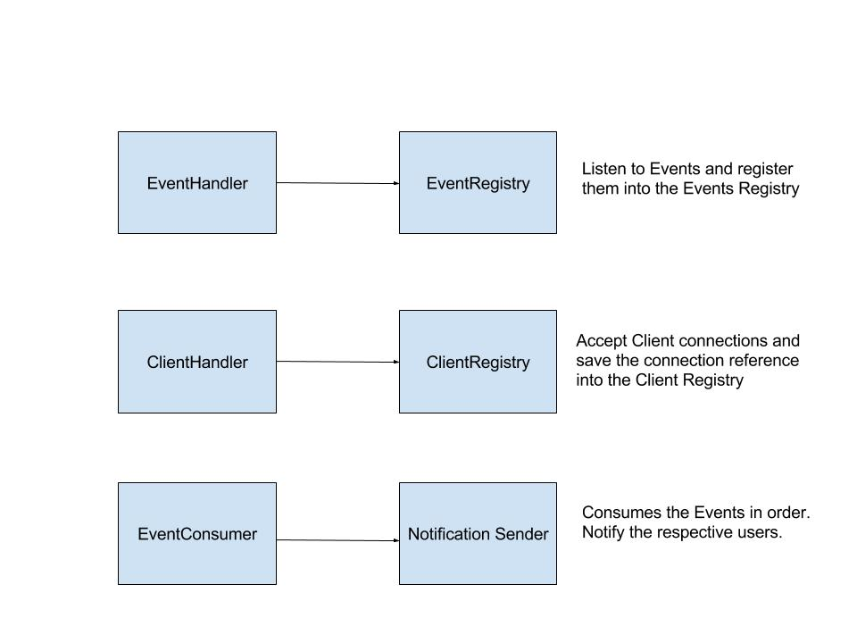

# FollowerMaze Solution

This application is responsible for listening to an event source and to
forward them to connected clients when appropriate.

## How it works

The application will listen for TCP connections in two ports: `9090` and `9099`.
Clients will connect to `9099` and will start listening to events. The event
source connects to `9090` and starts sending events.

After getting those connections, the application will start forwarding the events
to relevant clients.

## How to run

This application is written in Elixir and uses `mix` to manage dependencies and
to build the app.

First, make sure to have Elixir `1.4+` installed. The installation steps can
be found [here](http://elixir-lang.org/install.html).

After a successful installation, follow these steps:

  * `$ mix deps.get` to get the dependencies
  * `$ ./server.sh`

## Development and tests

Before adding a feature, make sure that all the tests are green, by running:

`$ mix test`.

Please add unit and integration tests for your new feature.

## The Application Design

The application has a relatively simple flow:

It starts two servers:

  * **ClientHandler**
  * **EventsHandler**

The **EventsHandler** will listen to the event source and register the `Event`
to the `Registries.Events` registry.

The **ClientHandler** will listen to clients connecting to it and it will save
the reference to these connections in `Registries.ConnectedClients` registry.

The `EventConsumer` is started together with the servers. It will fetch events from
the `Registries.Events` register and will deliver them to the respective users,
using the `EventForwarder`.

There is also a mechanism to store the users and their respective followers. It
is updated when consuming the events, and the information is stored in the
`Registries.Followers` registry.

## Notes about further improvements

It is important no note that the project is not using a back-pressure mechanism
when consuming the events. This could be applied in the future, together with a
partition mechanism (for scaling purpose). We could create multiple consumers,
based on a partition rule.

Another point is related to the client connection. Every time a client connects
to the server, it will start a new process. In order to prevent a memory overflow,
we could use a poll mechanism, so we can handle a finite amount of connections at
the same time.
